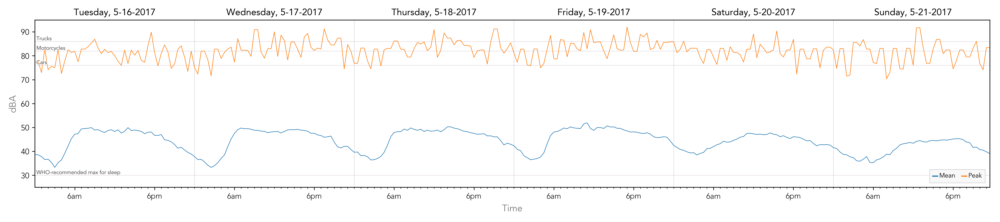
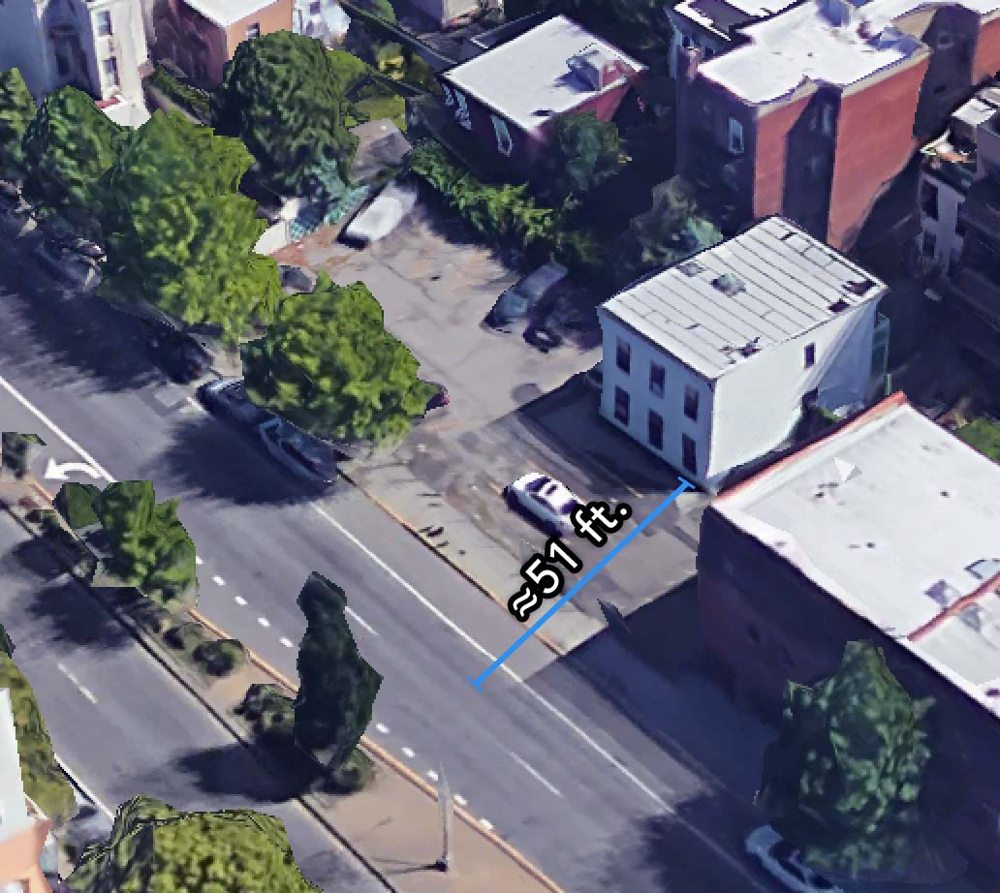
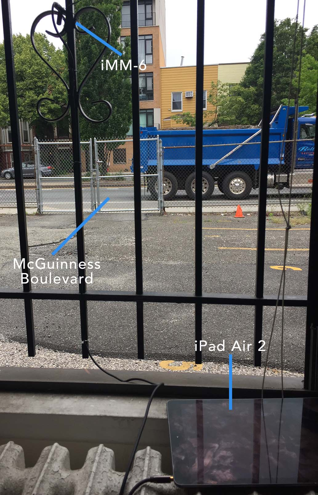

# Sounds of McGuinness

[More graphs](analyze/graphs).

You can [listen](https://soundcloud.com/tim-clem-404086192/sounds-of-mcguinness).

There's also a [less technical, briefer writeup](https://misterfifths.github.io/sounds-of-mcguinness).

### What's this then?

I live on McGuinness Boulevard, a loud 4-lane road in Brooklyn. This project started because I wondered just how loud it actually is. And how loud is *too* loud, both legally and psychically?

*It looks so calm with no cars on it.*

To that end, I learned a lot about sound (turns out it's really complicated) and the laws concerning traffic noise. I bought a microphone and recorded the street for 6 days. The result is some [pretty graphs](analyze/graphs) and an [obnoxious supercut](https://soundcloud.com/tim-clem-404086192/sounds-of-mcguinness) of all the (potentially) illegal road noise.

This document describes my research and process.

### External Resources

- The supercut of all (potentially) illegal sounds over a 6-day recording period in May 2017 is located [here](https://soundcloud.com/tim-clem-404086192/sounds-of-mcguinness). It was generated with the [analysis scripts](analyze) in this project.
- The raw AAC files captured by the [iOS app](NoiseRecorder) are [here](https://drive.google.com/open?id=0By0v4sT5asPNNmctcjc3ZWFjVXc). They are under the [CC by-attribution 3.0 license](https://creativecommons.org/licenses/by/3.0/us/).

### McGuinness

Greenpoint's own "McGuinness Expressway" (aka the "Pulaski Raceway", aka the "Brooklyn Boulevard of Death") connects the Pulaski Bridge to the BQE. It started life as humble Oakland Street, but was widened in 1954. I can't find anything blaming the project on Robert Moses, but I'm going to assume he strongly approved.

The road is [infamous for reckless driving](http://gothamist.com/2010/04/26/after_fatal_hit-and-run_mcguinness.php). Indeed, in 2014, as part of a citywide program addressing traffic fatalities, the speed limit on the road was [reduced from 30 to 25 MPH](http://gothamist.com/2014/04/23/mcguinness_boulevard_gets_slow_zone.php). I didn't test the speed of vehicles, but it's probably safe to assume [the reduction made little difference](http://gothamist.com/2014/11/08/speed_limit_mcguinness.php). After all, it's a wide, 4-lane road that connects to two major highways.

### dB, dBFS, dB SPL, dBA, and you

#### Meet the decibels

Before turning to the legal limits on volume, let's talk about sound. Measuring loudness turns out to be complicated. You're probably thinking "it's just decibels – that doesn't sound so hard." Right and wrong.

[Wikipedia says](https://en.wikipedia.org/wiki/Decibel) that a decibel (dB) is "a logarithmic unit used to express the ratio of two values", one of which is some "standard reference value." There's the rub. Decibels, with no other qualification, are kind of a nonsense unit. You must describe to what they are relative, or the value has no meaning. When people talk about decibels in sound, they're usually talking about one of dBFS, dB SPL, or a weighted value like dBA.

dbFS is relative to "full scale" - the loudest sound the hardware supports before clipping (making a really horrible garbled noise). dBFS therefore varies with hardware. Somewhat strangely, the values are usually negative, with 0 representing the maximum volume and something like -3 meaning "three decibels below full scale." Most audio software like, say, Audacity, use dBFS.

dB SPL is a measure of "sound pressure level." [Quoth Wikipedia](https://en.wikipedia.org/wiki/Sound_pressure#Sound_pressure_level), it's relative to 20 μPa, the threshold of human hearing. The result is a sensible unit, where everyone (mostly) agrees on the reference.

Finally, there's dBA. Humans are more sensitive to certain frequencies, meaning sounds with equal dB SPL may not *seem* to be equal in volume. dBA attempts to correct that weirdness by emphasizing certain frequencies over others. The result is that sounds with equal dBA are roughly equal in loudness to the human ear. Most things dealing with human perception of volume (e.g., laws) use dBA. The "A" is for [A-weighting](https://en.wikipedia.org/wiki/A-weighting).

On top of the decibel confusion, there's distance to consider. Obviously, as you move farther away from a sound source, it becomes less loud. This fact makes ["volume of common sounds" tables](https://www.nidcd.nih.gov/health/i-love-what-i-hear-common-sounds) largely meaningless unless they include the distance at which the measurement was taken.

#### Measurement

So, how do you actually measure dBA? It's a two-step process: take a dB SPL measurement using a calibrated microphone, and then use software to apply A-weighting to your recording.

Calibrated microphones are engineered to have a precise conversion between their dBFS and dB SPL. To oversimplify, it's roughly the case that there's some magic constant you can add to convert from one to the other.

After all that work, the good news is that applying A-weighting is pretty trivial with most sound-processing libraries.

### The law and other concerns

#### NYC

Now that we understand a bit about measuring sound, let's turn to the lawbooks. NYC's rules are a little bit complicated. They're the purview of the Department of Environmental Protection, and laid out in the [Administrative Code, Title 24, Subchapter 6, Section 236](http://library.amlegal.com/nxt/gateway.dll/New%20York/admin/title24environmentalprotectionandutiliti/chapter2noisecontrol?f=templates$fn=default.htm$3.0$vid=amlegal:newyork_ny$anc=JD_24-236). Subsection (e) states the actual decibel limits are in "section 386 of the vehicle and traffic law."

Below, I've collated [VAT § 386, tables 1, 2 & 3](http://nyscriminallaws.com/vt/article10.htm#t386). These measurements are to be collected at 50 feet from the center of the front of the vehicle.

| Vehicle type       | Max. dBA, speed limit ≤35 MPH | Max. dBA, speed limit >35 MPH
---------------------|-------------------|------------------
| Trucks (>10k lbs.) | 86                | 90
| Motorcycles        | 82                | 86
| Other (e.g., cars) | 76                | 82

Interestingly, [as of 1998](http://www.nonoise.org/lawlib/cities/newyork.htm#232) (and probably later), the limit on the "Other" category was 70 dBA. NYC actually **raised** the limit for cars at some point in recent history.

One other salient bit of the code is this: on roads with a speed limit of 35 MPH or less, the use of [compression brakes](https://www.youtube.com/watch?v=kc9-hYFQR3I&feature=youtu.be&t=86) (aka engine or jake brakes) is illegal except in emergencies ([NYC AC § 24-236(d)(2)](http://library.amlegal.com/nxt/gateway.dll/New%20York/admin/title24environmentalprotectionandutiliti/chapter2noisecontrol?f=templates$fn=default.htm$3.0$vid=amlegal:newyork_ny$anc=JD_24-236)). I counted 58 uses of a jake brake over 70 dBA in my 6-day recording session (see runs tagged "jake brake" in the [raw data](analyze/raw)).

#### WHO

For reference, I thought it would be interesting to track down other recommendations on sound limits. The World Health Organization published the [Night Noise Guidelines for Europe](http://www.euro.who.int/__data/assets/pdf_file/0017/43316/E92845.pdf) in 2009. They suggest that "[i]f negative effects on sleep are to be avoided the equivalent sound pressure level should not exceed 30 dBA indoors for continuous noise."

#### Enforcement

If you experience a loud vehicle, [NYC suggests you call 311](http://www1.nyc.gov/nyc-resources/faq/432/how-do-i-report-a-noisy-vehicle). From January 1, 2010 to May 28, 2017, there have been only 59 vehicular noise complaints involving McGuinness in some way (see the [311 data](https://nycopendata.socrata.com/Social-Services/311-Service-Requests-from-2010-to-Present/erm2-nwe9)). To me, it makes sense this number is so low: calling 311 to report a passing vehicle makes no sense. In fact, the 311 database doesn't even seem to have a category for engine, brake, or general vehicle noise – just music, horns, and idling.

So, how should these laws be enforced? The letter of the law would seemingly require precisely positioned microphones, one per lane, and cameras or humans to note the type of vehicle making noise. That scenario seems unlikely.

The noise code shares problems with many traffic laws: it's violated regularly, and only enforced if a police officer is in the right place at the right time. Traffic cameras can catch speeders and those who run red lights. Perhaps technology could help enforce noise limits as well; I lack the expertise to make a judgement about how complicated or effective that would be.

In the meantime, periodic enforcement "pushes" might be helpful. If a small group of traffic police staked out a stretch of McGuinness and issued tickets for noise violations, it would at least raise awareness that there *are* limits and that someone is paying attention.

Certainly the NYPD has bigger fish to fry. But given the number of people in the city who live along highways, and the repercussions on [sleep, heart disease, stress, child development, and more](https://en.wikipedia.org/wiki/Health_effects_from_noise), the problem at least deserves some recognition.

### Process

#### Recording

I purchased a [Dayton Audio iMM-6 microphone](http://daytonaudio.com/index.php/imm-6-idevice-calibrated-measurement-microphone.html). This is a fairly affordable calibrated microphone designed to work with iOS and Android devices via the three-ring headphone jack (TRRS).

As I mentioned in the [section above](#measurement), calibrated microphones have some precise conversion between dBFS and dB SPL. Unfortunately, that's not the sort of information most consumers care about, and isn't easily obtained. I did some non-scientific calibration tests using the app suggested by Dayton Audio and found that adding 93.5 to the dBFS got me fairly accurate dB SPL. I discuss this issue more in the [Caveats](#caveats) section below.

I mounted the iMM-6 outside a window facing the street and used an extension cable to connect the microphone to my iPad Air 2.

On the iPad, I used a [custom app](NoiseRecorder) to capture audio in 2-hour segments. The app hosts a file server, so I could periodically remove the files from the device to save space and incrementally process the data.

#### Processing

Once I had my audio files, I wrote [a bunch of Python scripts](analyze) to analyze them. I used a few great libraries for processing audio, namely [aubio](https://aubio.org) and [Pydub](http://pydub.com/). I also learned a lot from fiddling with [Librosa](http://librosa.github.io/), and [NumPy](https://docs.scipy.org/doc/numpy/reference/index.html) was super handy.

The general flow for processing data is this:

1. Apply A-weighting using aubio.
2. Using Pydub, find patches of loud audio and collect statistics (mean and peak volume over short intervals).
3. Manually tag loud patches. I did this to clean up the output, which frequently contained wind blowing into the microphone (see [Caveats](#caveats)). I was also interested in counting ["jake brakes"](#nyc) and emergency vehicles.
4. Graph the statistics using [Matplotlib](http://matplotlib.org/).
5. Make a horrendous supercut of the loud audio segments using Pydub.

You can see more details and read the scripts [here](analyze).

### Results

#### Caveats

- **Vehicle types.** I have no way of knowing precisely what type of vehicle is making what sound. This means I can't say with any certainty that a law is being broken (except when it exceeds the truck maximum, of course). A lot of times it's obvious that a given sound is a truck or motorcycle, but I've made no attempt to categorize them.
- **Distance.** My microphone is roughly 50 feet from the center of the nearest lane of traffic. However, McGuinness Boulevard is 4 lanes wide with a median. So, I have no way of knowing the actual dBA of any vehicle at 50 ft., which is what the law mandates. I would need 4 properly positioned microphones, one per lane, to do this.
- **Calibration.** There's a lot of secrecy in how microphone calibration works. The proper dBFS to dB SPL conversion is shrouded in mystery and influenced by the recording hardware's response curves and the phase of the moon. It's a mystery to me how Dayton Audio's recommended app does what it does, and no one feels like sharing. So my calibration is a rough estimate.
- **Ambient noise.** The iMM-6 is an omnidirectional microphone, meaning it picks up all sounds in a sphere around it. This means it's subject to ambient noise. Proper measurement of traffic noise would probably need to use a directed microphone that picks up the sound coming from a tighter area around the vehicle in question.
- **Wind.** The iMM-6 is not really intended for long-term outdoor recording. I picked up a fair amount of wind blowing into the microphone, which I manually tagged and filtered out of the supercut.
- **Emergency vehicles.** I couldn't find any mention of emergency vehicles in the law. I've included them in the supercut, because they are typically accompanied by a lot of horn-honking.

#### Findings

You can check out the [graphs](analyze/graphs) and [audio supercut](https://soundcloud.com/tim-clem-404086192/sounds-of-mcguinness). Here are some numbers:

| Condition | Incidences in 6-day period* | Daily average | Average minutes between incidences |
------------------------------|-------|-------|----------------------
| ≥70 dBA (old car limit)     | 1,960 | 326.7 |  4                  |
| ≥76 dBA (current car limit) |   440 |  73.3 | 20                  |
| ≥82 dBA (motorcycle limit)  |    89 |  14.8 | 1 hour, 37 minutes  |
| ≥86 dBA (truck limit)       |    35 |   5.8 | 4 hours, 7 minutes  |
| "Jake brakes" ≥ 70 dBA      |    58 |   9.7 | 2 hours, 29 minutes |
| Horns ≥ 70 dBA              |    64 |  10.7 | 2 hours, 15 minutes |

**\*** *An "incidence" in this case is any occurrence of the given sound lasting at least one-tenth of a second. Any such sounds that happen within a half second of each other are repeatedly merged into one incidence. See the [stats and runs script](analyze/stats_and_runs.py) for technical details.*

A few things stood out to me:

- **Peaks.** There are a hell of a lot of really loud (and potentially illegal) noises. And if the old limit of 70 dBA for cars was still in place, there would be way more.
- **Jake brakes.** I counted 58 uses of a "jake brake" ≥70 dBA, which are [illegal except in emergencies](#nyc). These are actually illegal at *any* volume, so there were certainly more.
- **Horns.** Surprisingly few sounds ≥70 dBA were from horns. Anecdotally, I don't hear much horn-blowing on the road.
- **Rush hour.** I expected rush hours to be a more obvious bump on the graph, but more than anything, days are broken up solely by daytime and nighttime.
- **Weekends.** I had anecdotally noticed the road is quieter on weekends, and the data agree. Also interesting that volume reaches its peak around 6AM on weekdays, but not until 10AM or so on weekends. People sleep in.
