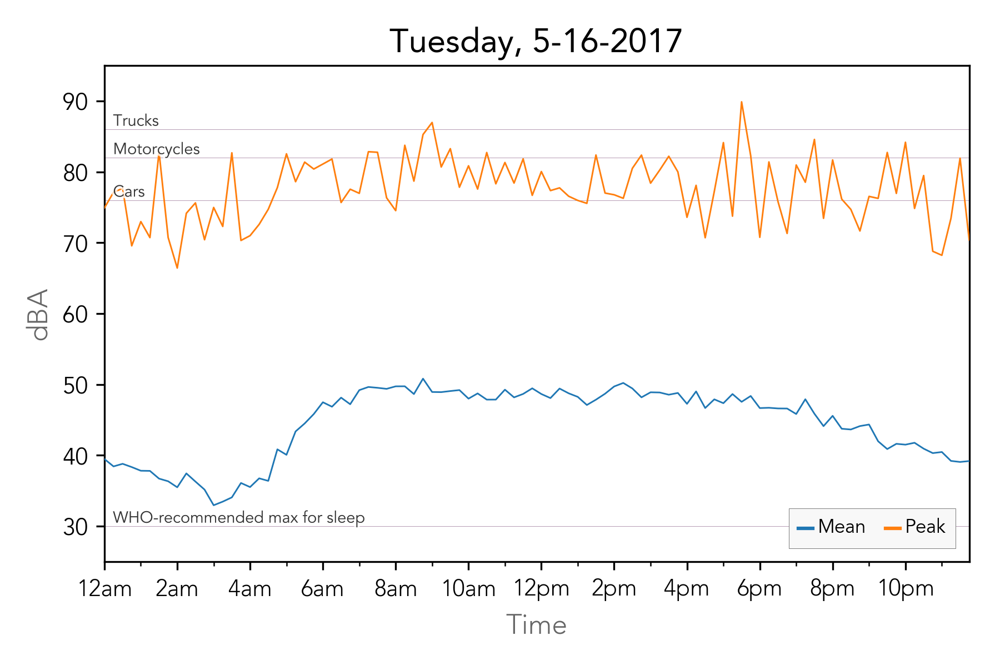
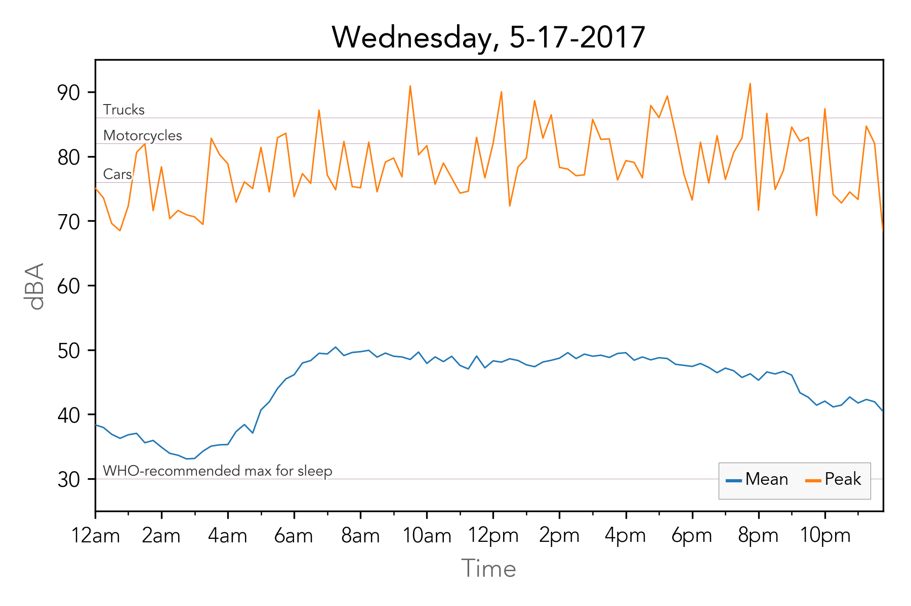
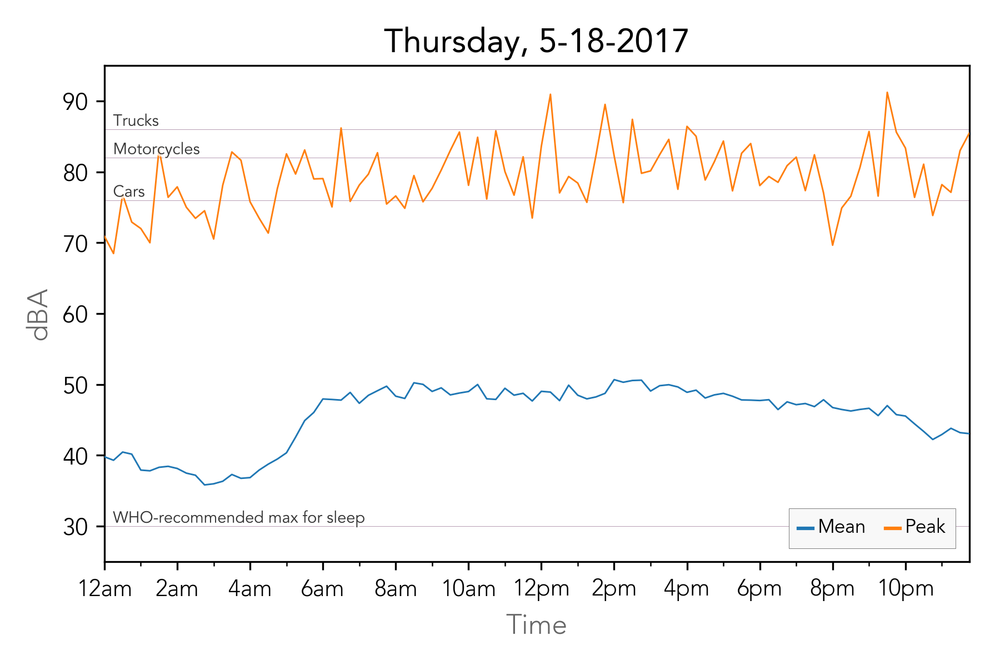
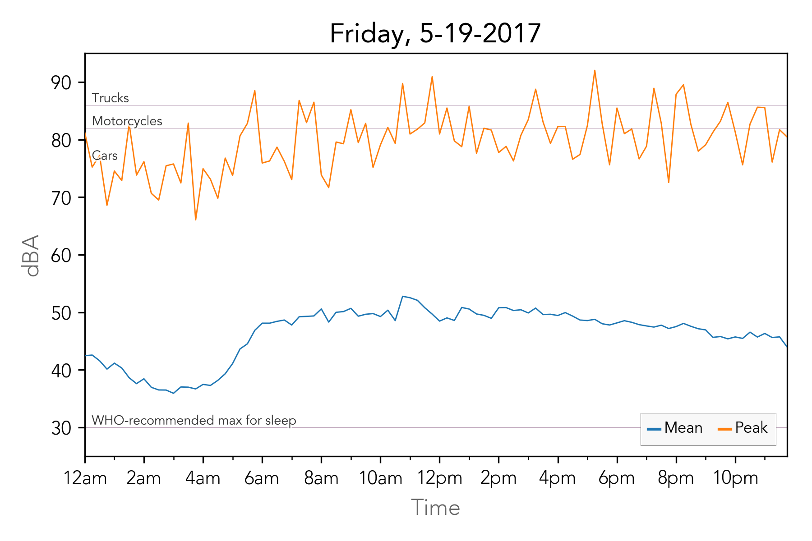
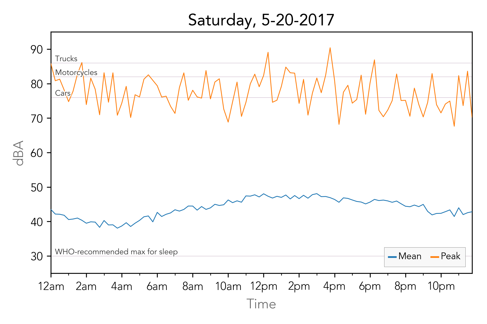
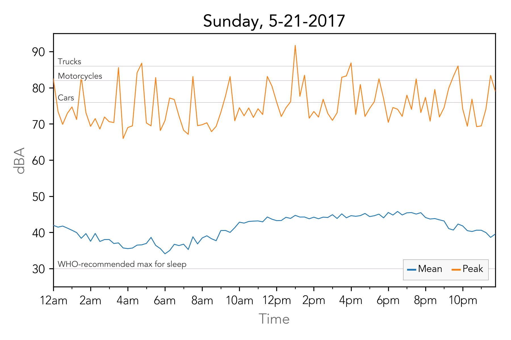

# Graphs

Graphs of a 6-day period in May 2017.

Blue lines are the mean volume over for each period, and orange lines are the peak. The horizontal lines represent various recommendations and legal limits for various types of vehicles. So, whenever the orange line crosses one of the upper horizontal lines, a law was potentially broken.

### All Six Days

### Daily Breakdowns

